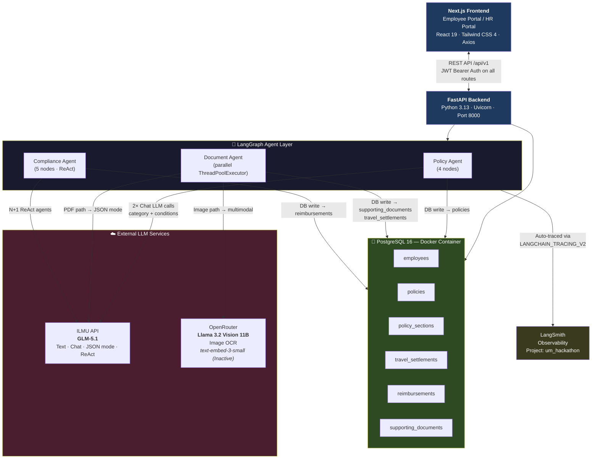
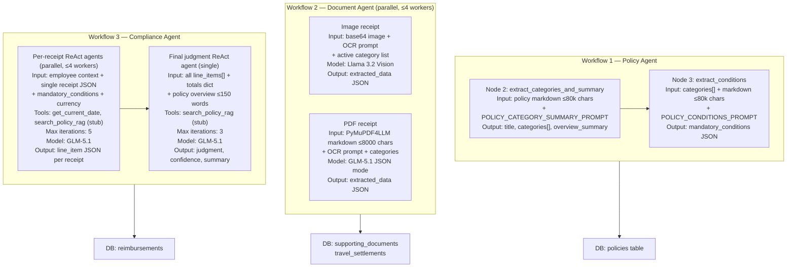
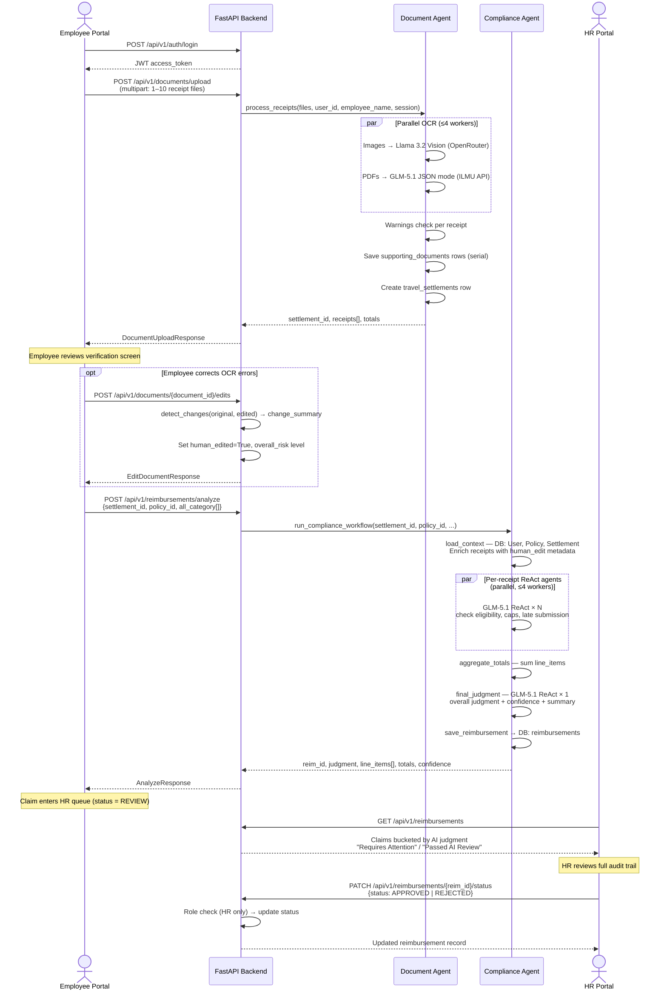
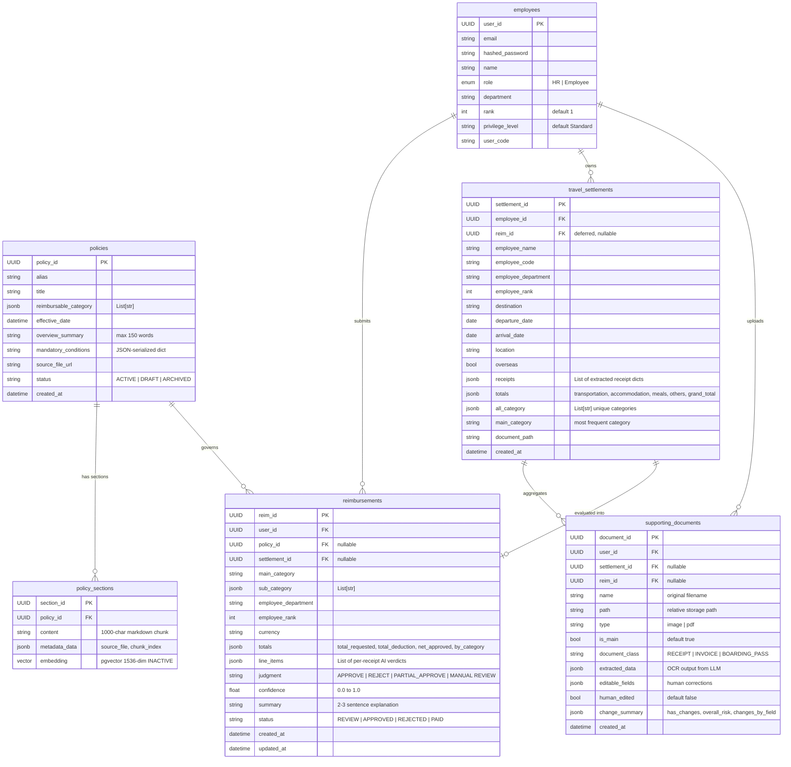
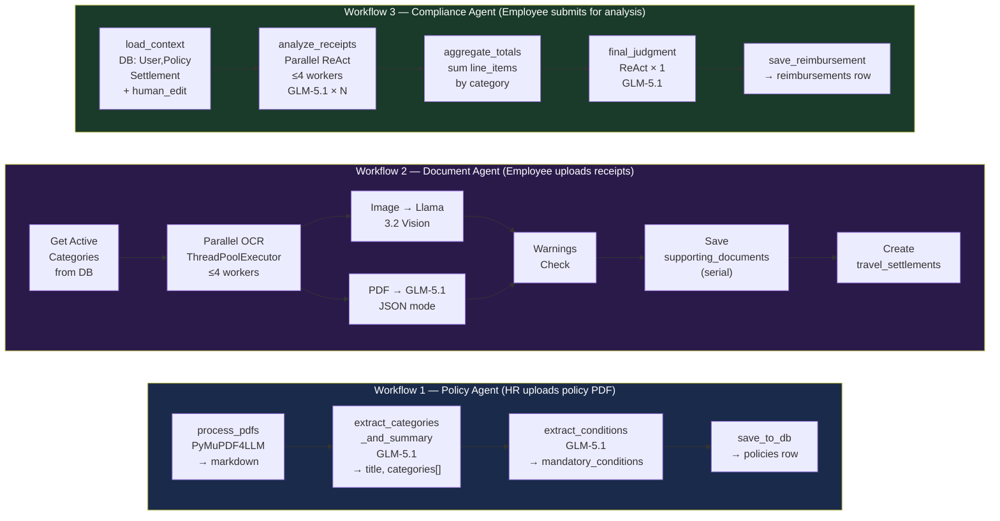

# SAD Mermaid Diagrams

All diagrams correspond to sections in `SAD_Report.md`. Each diagram is self-contained and can be rendered in any Mermaid-compatible viewer (GitHub, Notion, Obsidian, etc.).

---

## Diagram 1: System Dependency Map (Section 2.1.3)



---

## Diagram 2: Context Window Flow per LLM Call (Section 2.1.3)



---

## Diagram 3: Sequence Diagram — End-to-End Claim Submission Flow (Section 2.1.4)



---

## Diagram 4: Data Flow Diagram — Level 1 (Section 2.3.1.1)

```mermaid
flowchart TD
    EMP(["👤 Employee"])
    HR(["👔 HR"])
    LLMAPI(["☁️ LLM APIs\nILMU · OpenRouter"])

    subgraph FastAPI["FastAPI Application"]
        P1["P1: Auth Management\nlogin · register · JWT issue"]
        P2["P2: Receipt Ingestion\nPOST /documents/upload\nPOST /documents/{id}/edits\n→ Document Agent"]
        P3["P3: Compliance Analysis\nPOST /reimbursements/analyze\n→ Compliance Agent"]
        P4["P4: HR Decision Processing\nPATCH /reimbursements/{id}/status\n(HR role enforced)"]
        P5["P5: Policy Management\nPOST /policies/upload\n→ Policy Agent"]
    end

    subgraph DB[("🐘 PostgreSQL — Data Stores")]
        D1["D1: employees"]
        D2["D2: policies"]
        D3["D3: policy_sections"]
        D4["D4: travel_settlements"]
        D5["D5: reimbursements"]
        D6["D6: supporting_documents"]
    end

    EMP -->|"email + password"| P1
    P1 -->|"JWT token"| P2
    EMP -->|"receipt files (JPEG/PNG/PDF)"| P2
    EMP -->|"edited field values"| P2
    EMP -->|"settlement_id, policy_id"| P3

    HR -->|"policy PDFs + alias"| P5
    HR -->|"APPROVED / REJECTED"| P4

    P2 <-->|"Vision LLM (images)\nText LLM (PDFs)"| LLMAPI
    P3 <-->|"Chat LLM ReAct × N+1"| LLMAPI
    P5 <-->|"Chat LLM × 2 calls"| LLMAPI

    P1 -->|"read"| D1
    P2 -->|"write"| D6
    P2 -->|"write"| D4
    P2 -->|"read"| D1
    P3 -->|"read"| D4
    P3 -->|"read"| D2
    P3 -->|"write"| D5
    P4 -->|"read + write status"| D5
    P5 -->|"write"| D2
    P5 -->|"write"| D3

    P3 -->|"judgment, line_items"| EMP
    P4 -->|"final decision"| HR

    style FastAPI fill:#1a2a4a,color:#fff
    style DB fill:#1a3a1a,color:#fff
```

---

## Diagram 5: Entity Relationship Diagram — Normalized Database Schema (Section 2.3.2)



---

## Diagram 6: AI Agent Workflow — LangGraph Node Pipelines (Reference)


